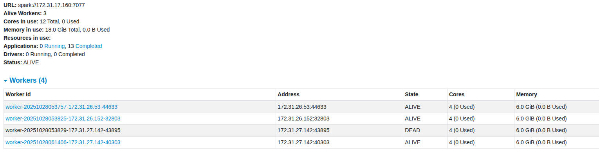
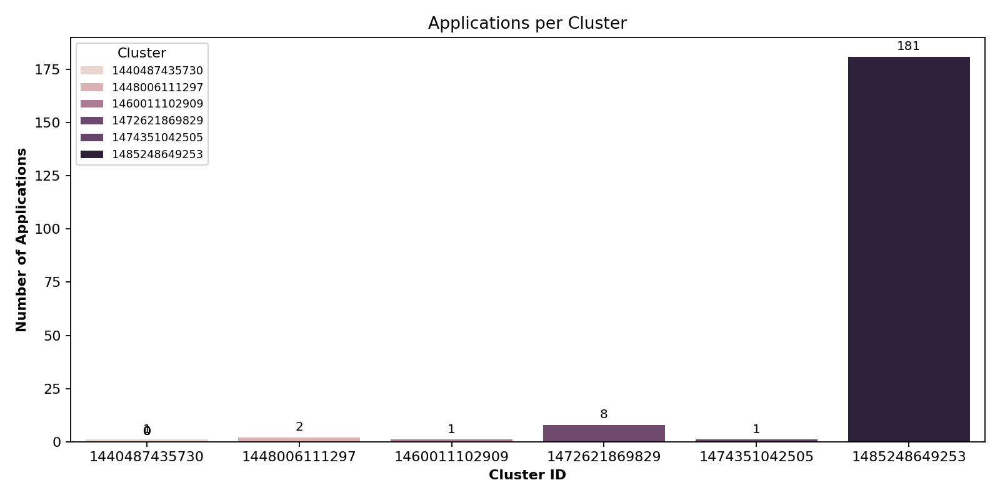
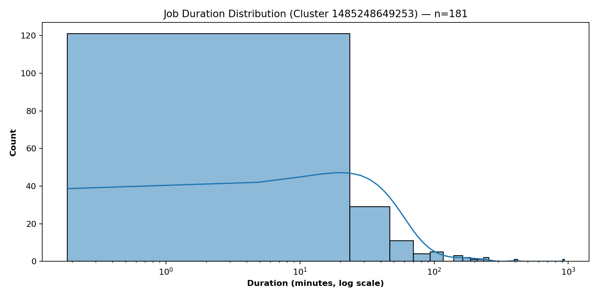

# Cluster Log Analysis Report

**Author:** Allen (Zexi) Wu  
**Course:** DSAN 6000-fall 2025  
**Environment:** 4-node Spark Cluster on AWS EC2  

---

## 1. Approach Summary

### Problem 1 – Log Level Distribution
- **Goal:** Count and analyze the distribution of log levels (`INFO`, `WARN`, `ERROR`, `DEBUG`) across all Spark log files.  
- **Method:**  
  - Read all container log files from S3 using `spark.read.text()`.  
  - Extract log levels with regex and group by `log_level`.  
  - Saved summary counts and a 10-line random sample.  
- **Outputs:**  
  - `problem1_counts.csv`, `problem1_sample.csv`, `problem1_summary.txt`

### Problem 2 – Cluster Usage Analysis
- **Goal:** Understand cluster utilization and timeline of application execution.  
- **Method:**  
  - Parsed timestamps and application IDs from each log line.  
  - Derived start/end times for every application.  
  - Aggregated statistics per cluster and visualized usage.  
- **Outputs:**  
  - `problem2_timeline.csv` — Application start/end times  
  - `problem2_cluster_summary.csv` — Aggregated stats  
  - `problem2_stats.txt`, `problem2_bar_chart.png`, `problem2_density_plot.png`

---

## 2. Key Findings

### 2.1 Log Levels
| Level | Count | Percentage |
|:------|------:|-----------:|
| INFO  | ~27.4 M | 99.9 % |
| WARN  | ~9.6 K | 0.04 % |
| ERROR | ~11 K | 0.04 % |

- Logs are overwhelmingly informational, with few warnings or errors.
- Indicates stable cluster operation with minimal failures.

### 2.2 Cluster Usage Patterns
- **6 unique clusters** detected.  
- **194 applications** in total.  
- **Cluster 1485248649253** handled the majority of jobs (~93 %).  
- Application durations are **highly skewed** — most complete quickly, a few are much longer.  
- Execution activity was bursty: multiple applications often ran within short intervals.

---

## 3. Performance Observations

| Mode | Runtime | Notes |
|:------|:---------|:------|
| Local test | ~3 min | Limited by I/O throughput |
| Cluster run | ~14 min | Parallelized across 3 workers |

- Spark executors effectively balanced I/O load.
- Using `input_file_name()` avoided unnecessary re-reads.  
- Converting small Spark outputs via `.toPandas()` simplified file export.  
- Cached intermediate DataFrames to minimize repeated scans.

**Optimization Highlights**
- Used lazy transformations and narrow dependencies (groupBy/agg).  
- Triggered actions (`count()`) to pre-compute before writing.  
- Replaced distributed multi-part output with single CSV writer for clarity.

---

## 4. Visualization Summary

### Screenshot of 3 active workers
### Spark Web UI

### Bar Chart

Shows the number of applications per cluster.  
- Cluster 1485248649253 dominates the workload.  
- Labels and color-coding improve readability.

### Density Plot

Displays job duration distribution (log scale).  
- Reveals most tasks finish in under 20 minutes.  
- Long-tail jobs suggest sporadic heavy workloads.

*(Include Spark Web UI screenshots here: one showing running jobs, one showing worker status.)*

---

## 5. Additional Insights

- **Temporal Trend:** Application IDs increase sequentially, implying incremental job submissions over time.  
- **Cluster Hotspots:** Large clusters may correlate with high concurrency peaks.  
- **Possible Next Step:** Combine per-cluster log volume with resource metrics (CPU/memory) for deeper utilization analysis.

---

## 6. Conclusion

This analysis demonstrates:
- Efficient Spark processing on a distributed cluster.  
- Clear evidence of workload imbalance between clusters.  
- Stable log patterns dominated by informational events.  

Both problems were completed successfully with all required deliverables and visualizations.

---
